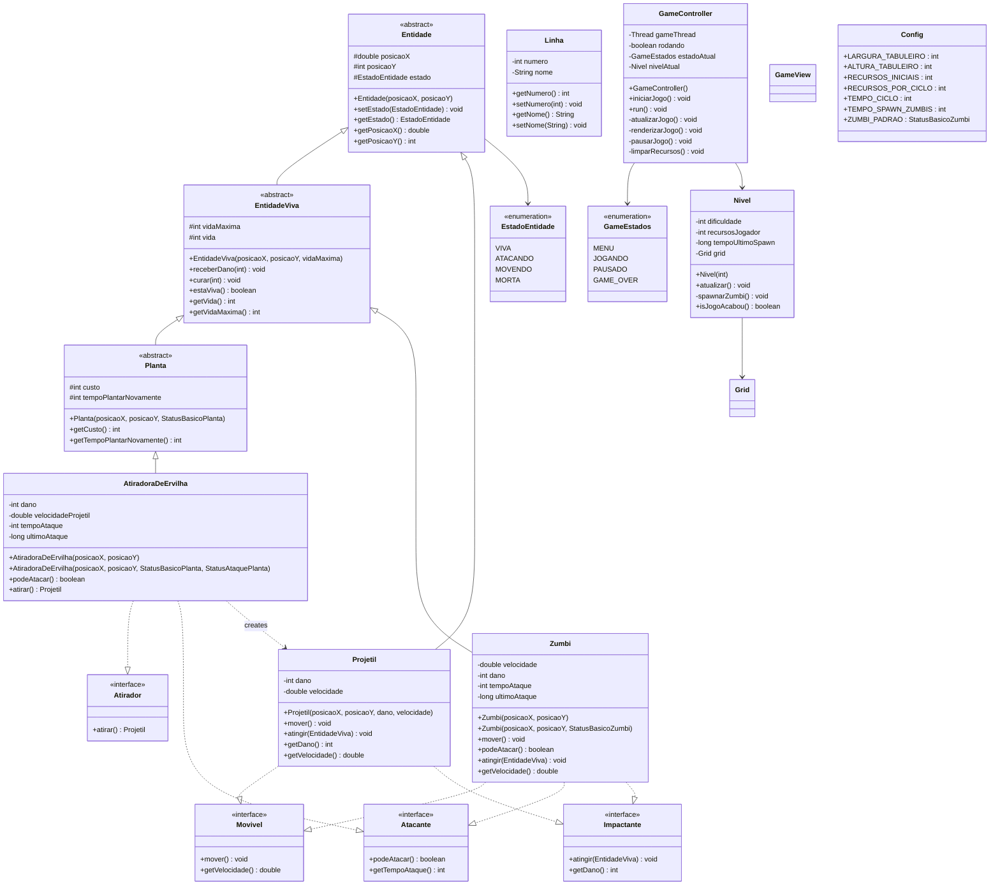

# Diagrama de Classes - Plants vs Zombies

## Visão Geral

Este documento apresenta o diagrama de classes completo do jogo Plants vs Zombies em Java.

## Diagrama Principal

## Descrição das Classes

### Hierarquia de Entidades

- **Entidade**: Classe abstrata base para todas as entidades renderizáveis do jogo (posição e estado)
- **EntidadeViva**: Estende Entidade, adiciona sistema de vida (HP) para plantas e zumbis
- **Projetil**: Entidade que se move em linha reta e causa dano ao impactar alvos

### Plantas

- **Planta**: Classe abstrata base para todas as plantas (gerencia custo e tempo de recarga)
- **AtiradoraDeErvilha**: Planta ofensiva que dispara projéteis contra zumbis

### Inimigos

- **Zumbi**: Inimigo que se move em direção à casa e ataca plantas no caminho

### Fase

- **Grid**: Representa o tabuleiro do jogo
- **Linha**: Representa uma linha/fileira do tabuleiro
- **Nivel**: Gerencia a dificuldade, recursos do jogador e spawn de zumbis

### Controle e Visualização

- **GameController**: Controla o loop principal do jogo (atualização e renderização)
- **GameView**: Responsável pela visualização do jogo
- **Config**: Armazena constantes e configurações do jogo

### Enumerações

- **EstadoEntidade**: Estados possíveis de uma entidade (VIVA, ATACANDO, MOVENDO, MORTA)
- **GameEstados**: Estados do jogo (MENU, JOGANDO, PAUSADO, GAME_OVER)

### Interfaces

- **Movivel**: Define contrato para entidades que podem se mover
- **Atacante**: Define contrato para entidades que podem atacar
- **Atirador**: Define contrato para entidades que disparam projéteis
- **Impactante**: Define contrato para entidades que causam dano ao colidir

## Padrões de Design Utilizados

- **Template Method**: Classes abstratas (Entidade, EntidadeViva, Planta) definem estrutura base
- **Strategy**: Interfaces (Movivel, Atacante, Atirador, Impactante) definem comportamentos intercambiáveis
- **Game Loop**: GameController implementa o padrão de loop de jogo com FPS e UPS fixos
